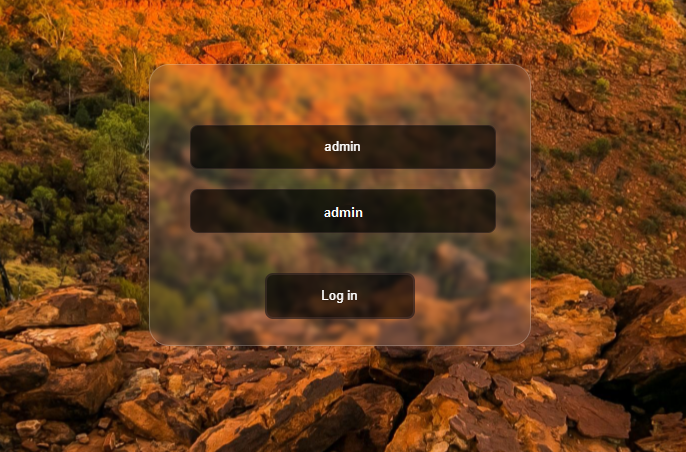
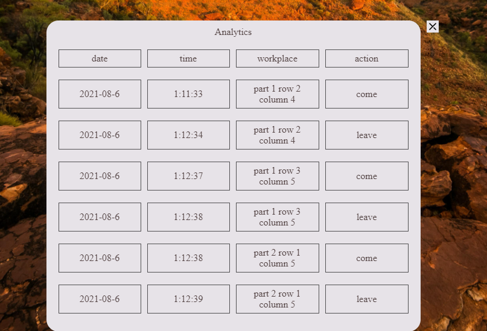

# web_project_for_workout_2

- [:ru: RUS](./README.ru.md) - Русская документация
- [:uk: ENG](./README.md) - English documentation

# About
A client application for tracking office visits and contact of sick employees with colleagues. The data is stored in localstorage.

The application has two themes.


Authentication window



To get started, you need to log in as an administrator and enter admin admin. Special privileges are available to the administrator: adding new employees, viewing visits to the office of all employees, viewing the date of illness of employees, changing the status at risk of being ill. The administrator can also delete old records of office visits, outdated records are those that are more than a month old.


After registering new employees, we can go to the main menu and go for one employee. The employee has the following functions: view the statistics of office visits, inform the administrator about the coronavirus disease. In case of illness, the working day for the employee is terminated and the opportunity to sit at the workplace is blocked until the administrator says in the Switch risk block that the employee is not contagious.



An example of how the application works


#  Install 

```
make
```

#  Run 

```
make run

```
#  Delete assembly files

```
make clean
```
