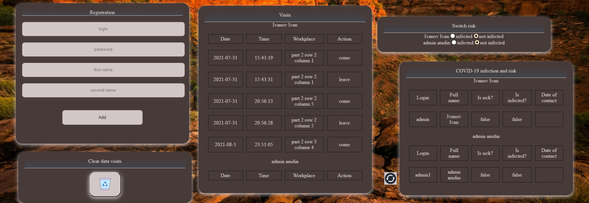
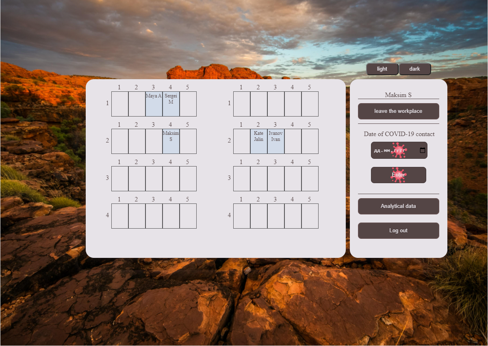

# web_project_for_workout_2

- [:ru: RUS](./README.ru.md) - Русская документация
- [:uk: ENG](./README.md) - English documentation

https://office-work.herokuapp.com/

# О приложении
Клиентское приложение для отслеживания посещения офиса и контакта заболевших сотрудников с коллегами. Данные хранятся в local storage. 

Приложение имеет две темы.


Окно аутентификации


Для начала работы нужно войти за администратора и ввести admin admin. Администратуру доступны особые привелегии: добавления новых сотрудников, просмотр посещения офиса всех сотрудников, просмотр даты заболевания сотрудников, изменения статуса под риском быть заболевшим. Также администратор может удалить старые записи посещения офиса, устаревшие записи те, которым больше месяца.



После регестрации новых сотрудников мы может выйти в главное меню и зайти за одного сотрудника. Сотруднику доступны функции: просмотреть статистику посещения офиса, сообщить администратуру о заболевании короновирусом. В случае заболевания рабочий день для сотрудника прекращается и возможность сесть за рабочее место блокируется до того момента, пока администратор не скажет в блоке Switch risk, что сотрудник не заразен.


Пример работы приложения




#  Install 

```
make
```

#  Run 

```
make run

```
#  Delete assembly files

```
make clean
```
